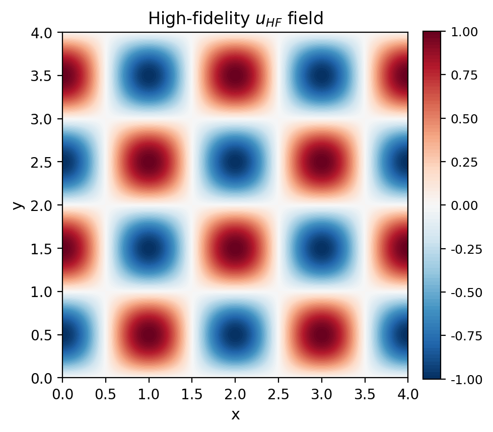
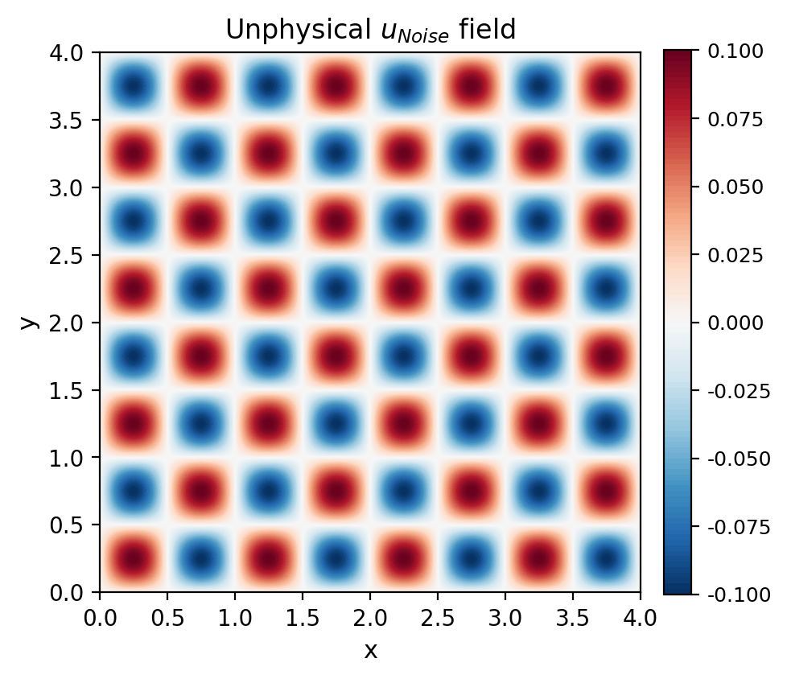
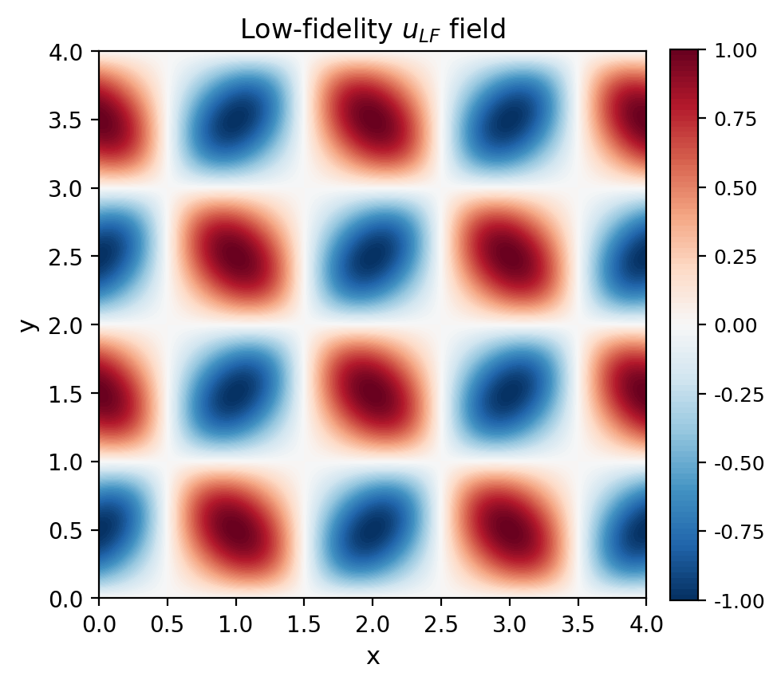
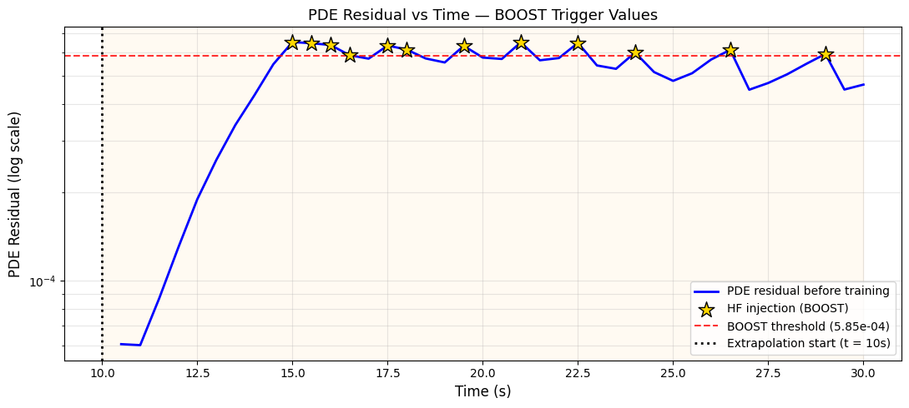
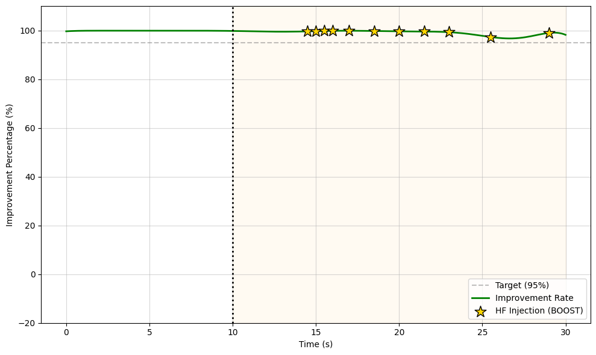

# Taylor-Green Vortex — Residual Correction PINN

A Physics-Informed Neural Network (PINN) that learns to correct a low-fidelity (LF) flow field toward the high-fidelity (HF) solution for the 2D Taylor-Green Vortex (TGV) problem, with adaptive extrapolation beyond the training window.

---

## Problem Setup

The **Taylor-Green Vortex** is a classical benchmark for 2D viscous flow with a known analytical solution, making it ideal for validating machine learning approaches in fluid dynamics.

- **Domain**: `[0, L] × [0, L]`, `L = 4.0`
- **Viscosity**: `ν = 0.001`
- **Training range**: `0 ~ 10s`
- **Extrapolation range**: `10 ~ 30s`

---

## Data Definition

The model is trained to correct the LF approximation toward the HF ground truth.

### High-Fidelity (HF) — Analytical TGV Solution

$$\quad u_{HF} = -\cos(\pi x)\sin(\pi y)\, e^{-2\pi^2 \nu t}$$

$$\quad v_{HF} = \sin(\pi x)\cos(\pi y)\, e^{-2\pi^2 \nu t}$$

$$\quad P_{HF} = -0.25\{\cos(2\pi x) + \cos(2\pi y)\}\, e^{-4\pi^2 \nu t}$$

### Unphysical Noise (simulating LF CFD error)

$$\quad u_{Noise} = 0.1e^{-2\pi^2 \nu t} \sin(2\pi x)\sin(2\pi y)$$

$$\quad v_{Noise} = 0.1e^{-2\pi^2 \nu t} \cos(2\pi x)\cos(2\pi y)$$

$$\quad P_{Noise} = 0.025e^{-4\pi^2 \nu t} \sin(\pi x)$$

### Low-Fidelity (LF) — HF + Noise

$$\quad u_{LF} = u_{HF} + u_{Noise} , \quad v_{LF} = v_{HF} + v_{Noise} , \quad P_{LF} = P_{HF} + P_{Noise}$$

|    HF Data    |        Noise        |    LF Data    |
| :-----------: | :-----------------: | :-----------: |
|  |  |  |

---

## Loss Functions

$$u_{pred} = u_{LF} + \delta u, \quad v_{pred} = v_{LF} + \delta v, \quad P_{pred} = P_{LF} + \delta P$$

### Data Loss

$$\mathcal{L}_{data} = \frac{1}{N}\sum_{i=1}^{N}\left[(u_{pred} - u_{HF})^2 + (v_{pred} - v_{HF})^2 + (P_{pred} - P_{HF})^2\right]$$

### Physics Loss (Navier-Stokes)

**Continuity equation:**

$$f_c = \frac{\partial u}{\partial x} + \frac{\partial v}{\partial y}, \qquad \mathcal{L}_{mass} = \frac{1}{N}\sum_{i=1}^{N} f_c(x_i, y_i, t_i)^2$$

**Momentum equations:**

$$f_u = \frac{\partial u}{\partial t} + u\frac{\partial u}{\partial x} + v\frac{\partial u}{\partial y} + \frac{\partial P}{\partial x} - \nu\left(\frac{\partial^2 u}{\partial x^2} + \frac{\partial^2 u}{\partial y^2}\right)$$

$$f_v = \frac{\partial v}{\partial t} + u\frac{\partial v}{\partial x} + v\frac{\partial v}{\partial y} + \frac{\partial P}{\partial y} - \nu\left(\frac{\partial^2 v}{\partial x^2} + \frac{\partial^2 v}{\partial y^2}\right)$$

$$\mathcal{L}_{momentum} = \frac{1}{N}\sum_{i=1}^{N}\left[f_u(x_i, y_i, t_i)^2 + f_v(x_i, y_i, t_i)^2\right]$$

**Total physics loss:**

$$\mathcal{L}_{physics} = \mathcal{L}_{mass} + \mathcal{L}_{momentum}$$

---

## Method

### Model Architecture

- **Input**: `(x, y, t)` → 3D coordinate vector
- **Fourier Embedding**: Random Fourier Features to mitigate spectral bias
- **Network**: 5-layer MLP with SiLU activations (hidden dim: 128)
- **Output**: residual corrections `(δu, δv, δp)` added to the LF base solution

$$u_{pred} = u_{LF} + \delta u, \quad v_{pred} = v_{LF} + \delta v, \quad P_{pred} = P_{LF} + \delta P$$

### Phase 1: Training (0 ~ 10s) — 3-Step Optimization

| Step | Optimizer          | Loss                                                  |
| ---- | ------------------ | ----------------------------------------------------- |
| 1    | Adam               | $\mathcal{L}_{data}$ only                             |
| 2    | Adam               | $100\cdot\mathcal{L}_{data} + \mathcal{L} _{physics}$ |
| 3    | L-BFGS fine-tuning | $100\cdot\mathcal{L}_{data} + \mathcal{L} _{physics}$ |

### Phase 2: Adaptive Extrapolation (10 ~ 30s)

The model extrapolates beyond the training window using a **PDE residual-based adaptive loop**:

- At each time step, $\mathcal{L}_{physics}$ is evaluated against an adaptive threshold
- If residual **exceeds** threshold → **BOOST**: inject HF data and retrain locally (Adam × 300 + L-BFGS × 50)
- If residual **within** threshold → **KEEP**: self-refine using PDE loss + replay buffer regularization (× 200)

This prevents catastrophic forgetting while ensuring physical consistency throughout extrapolation.

---

## Results

### MSE Comparison (Training + Extrapolation)



- **Blue**: Model prediction error (LF + PINN correction)
- **Red dashed**: LF baseline error
- **Stars**: Time steps where HF data was injected (BOOST)
- **Dotted vertical line**: boundary between training (left) and extrapolation (right)

### Improvement Rate over LF Baseline

$$MSE_{LF} = \frac{1}{N}\sum_{i=1}^{N}(u_{LF} - u_{HF})^2, \qquad MSE_{pred} = \frac{1}{N}\sum_{i=1}^{N}(u_{pred} - u_{HF})^2$$

$$Improvement = \frac{MSE_{LF} - MSE_{pred}}{MSE_{LF}} \times 100\%$$



The model maintains **>95% improvement** over the LF baseline throughout the extrapolation range (10 ~ 30s).

---

## File Structure

```
TGV/
├── train.py          # Phase 1 (training) + Phase 2 (adaptive extrapolation)
├── evaluate.py       # Evaluation and result visualization
├── mse_log.png
│── imp_rate.png
│── HF.png
│── Noise.png
│── LF.png
└── README.md
```

---

## Requirements

```
torch
numpy
matplotlib
pandas
```

```bash
pip install torch numpy matplotlib pandas
```

---

## Usage

```bash
# Step 1: Train the model (Phase 1 + Phase 2)
python train.py

# Step 2: Evaluate and generate result plots
python evaluate.py
```

> **Note**: Before running `evaluate.py`, manually update `manual_boost_times` in the file to match the BOOST time steps logged during Phase 2 training.
